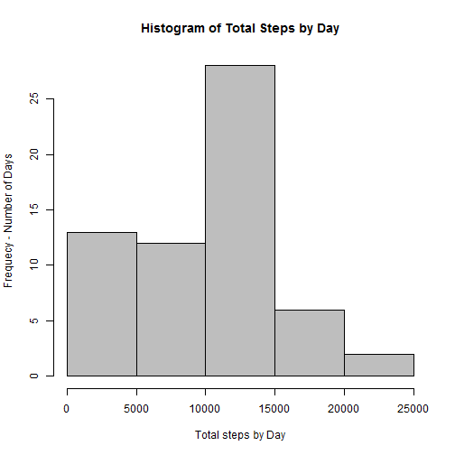
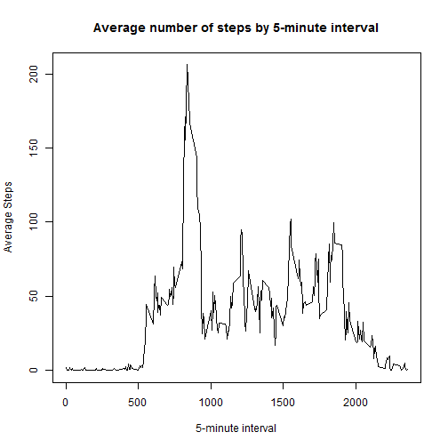

##Loading packages


```r
library(dplyr)
library(ggplot2)
```

##Loading and preprocessing the data


```r
# Read Data

setwd("C:/Users/conradwo/Documents/R/Reproducible/Project 1/Git/RepData_PeerAssessment1")
activity_data <- read.csv("activity.csv")
```

## What is mean total number of steps taken per day?


1.Calculate the total number of steps taken per day


```r
steps_by_day <-activity_data %>% group_by(date) %>% summarize(sum(steps, na.rm=TRUE))
names(steps_by_day) <- c("date", "total_steps")

head(steps_by_day)
```

```
## Source: local data frame [6 x 2]
## 
##         date total_steps
## 1 2012-10-01           0
## 2 2012-10-02         126
## 3 2012-10-03       11352
## 4 2012-10-04       12116
## 5 2012-10-05       13294
## 6 2012-10-06       15420
```

2.If you do not understand the difference between a histogram and a barplot, research the difference between them. Make a histogram of the total number of steps taken each day


```r
hist(steps_by_day$total_steps, main="Histogram of Total Steps by Day", xlab="Total steps by Day", col="Gray", ylab='Frequecy - Number of Days')
```

 

3.Calculate and report the mean and median of the total number of steps taken per day


```r
med <- format(median(steps_by_day$total_steps), digits=1, nsmall=2)

mean <- format(mean(steps_by_day$total_steps), digits=1, nsmall=2)
```

The median number of steps by day is: 10395

The mean number of steps by day is: 9354.23

## What is the average daily activity pattern?

1.Make a time series plot (i.e. type = "l") of the 5-minute interval (x-axis) and the average number of steps taken, averaged across all days (y-axis)


```r
steps_by_interval <- activity_data %>% group_by(interval) %>% summarize(mean(steps, na.rm=TRUE))
names(steps_by_interval) <- c("interval", "avg_steps")

with (steps_by_interval, plot(interval, avg_steps, type="l", main="Average number of steps by 5-minute interval", xlab="5-minute interval", ylab="Average Steps"))
```

 

2.Which 5-minute interval, on average across all the days in the dataset, contains the maximum number of steps?


```r
max <- max(steps_by_interval$avg_steps)
int <- steps_by_interval[steps_by_interval$avg_steps == max, "interval"]
```

The interval 835 has the maximum average number of steps (206.1698113)

## Imputing missing values

Note that there are a number of days/intervals where there are missing values (coded as NA). The presence of missing days may introduce bias into some calculations or summaries of the data.

1.Calculate and report the total number of missing values in the dataset (i.e. the total number of rows with NAs)


```r
steps_na <- is.na(activity_data$steps)
total_na <- sum(steps_na)
```
    
The total number of missing values is: 2304


2.Devise a strategy for filling in all of the missing values in the dataset. The strategy does not need to be sophisticated. For example, you could use the mean/median for that day, or the mean for that 5-minute interval, etc.


```r
# Calculates the average steps for each 5-minute interval 

avg_steps_interval <- activity_data %>% group_by(interval) %>% summarize(mean(steps, na.rm=TRUE))
names(avg_steps_interval) <- c("interval", "avg_steps")

head(avg_steps_interval)
```

```
## Source: local data frame [6 x 2]
## 
##   interval avg_steps
## 1        0 1.7169811
## 2        5 0.3396226
## 3       10 0.1320755
## 4       15 0.1509434
## 5       20 0.0754717
## 6       25 2.0943396
```


3.Create a new dataset that is equal to the original dataset but with the missing data filled in.


```r
# Merges the activity data and the average steps for each interval, and updates the NA's with the average for the interval

merged = merge(activity_data, avg_steps_interval)
merged_na <- is.na(merged$steps)
merged[merged_na, "steps"] <- merged[merged_na, "avg_steps"]
nas <- sum(merged_na)
```

Number of rows updated with the interval average: 2304 


4.Make a histogram of the total number of steps taken each day and Calculate and report the mean and median total number of steps taken per day. Do these values differ from the estimates from the first part of the assignment? What is the impact of imputing missing data on the estimates of the total daily number of steps?


```r
steps_by_day <-merged %>% group_by(date) %>% summarize(sum(steps, na.rm=FALSE))
names(steps_by_day) <- c("date", "total_steps")

hist(steps_by_day$total_steps, main="Histogram of Total Steps by Day", xlab="Total steps by Day", col="Gray", ylab='Frequecy - Number of Days')
```

-1.png) 

```r
# Calculate mean and median, use format to avoid the result being printed in exponential notation

med <- format(median(steps_by_day$total_steps), digits=1, nsmall=2)

mean <- format(mean(steps_by_day$total_steps), digits=1, nsmall=2)
```

Median number of steps by day: 10766.19

Mean number of steps by day: 10766.19

#### Conclusion: The impact of imputing missing data on the estimats of the total daily number of steps is that the data becomes normalized 

## Are there differences in activity patterns between weekdays and weekends?

For this part the weekdays() function may be of some help here. Use the dataset with the filled-in missing values for this part.

1.Create a new factor variable in the dataset with two levels - "weekday" and "weekend" indicating whether a given date is a weekday or weekend day.


```r
merged$day_type <- ifelse(weekdays(strptime(merged$date, "%Y-%m-%d"), abbreviate=T) %in% c("Sat", "Sun"), "weekend", "weekday")

head(merged)
```

```
##   interval    steps       date avg_steps day_type
## 1        0 1.716981 2012-10-01  1.716981  weekday
## 2        0 0.000000 2012-11-23  1.716981  weekday
## 3        0 0.000000 2012-10-28  1.716981  weekend
## 4        0 0.000000 2012-11-06  1.716981  weekday
## 5        0 0.000000 2012-11-24  1.716981  weekend
## 6        0 0.000000 2012-11-15  1.716981  weekday
```


2.Make a panel plot containing a time series plot (i.e. type = "l") of the 5-minute interval (x-axis) and the average number of steps taken, averaged across all weekday days or weekend days (y-axis). See the README file in the GitHub repository to see an example of what this plot should look like using simulated data.


```r
steps_by_interval <- merged %>% group_by(day_type, interval) %>% summarize(mean(steps, na.rm=FALSE))
names(steps_by_interval) <- c("day_type", "interval", "avg_steps")

qplot(interval, avg_steps, data = steps_by_interval, facets= day_type~., geom="line", ylab="Number of Steps", xlab="5-minute Interval", main="Average steps taken per 5-minute interval by Weekday/Weekend")
```

-1.png) 

